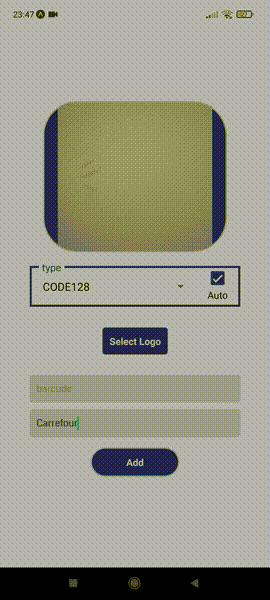
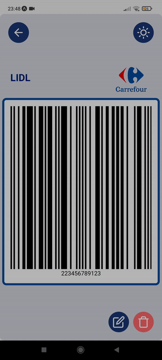

# Barcodes
Keep all your barcodes in one place.

Add new barcode to your colletcion by scaning it with your camera or create generate a new one.

## App Preview
List Screen | Selected / Edit Screen | Add Screen
:-------------------------:|:-------------------------:|:-------------------------:
  |    |  

## Platforms
✅ Android  
✅ IOS

## Features
- **Scan barcodes with phone's camera**
- Store mutiple barcodes
- **Auto type finder**
- **Barcodes validation for every type**
- Single barcode display (for scanning)
- **Set brightness to max from app (for scanning)**
- Edit barcode
- Asign logo to barcode
- Upload custom logo

## Supported barcodes types:
- EAN13
- EAN8
- EAN5
- CODE128 **?**
- CODE39 **?**
- ITF14
- UPC
- UPCE

## Technologies
- [React Native](https://reactnative.dev/)
- [Expo](https://reactnative.dev/)

### Core libraries:
  - [react-native-barcode-generator](https://github.com/Kichiyaki/react-native-barcode-generator)
  - [expo-barcode-scanner](https://docs.expo.dev/versions/latest/sdk/bar-code-scanner/)  

## Dev installation

1. Clone the repository.  
`git clone https://github.com/KarolPlonka/barcode/`

2. Install node packages.  
`npm install`

3. Run server.  
`npm start`

4. Download Expo App on your phone or use emulator.  
Expo for **Android**: https://play.google.com/store/apps/details?id=host.exp.exponent  
Expo for **IOS**: https://apps.apple.com/us/app/expo-go/id982107779

